# HelpMe Hub - Architecture & Design Documentation

## System Architecture

### High-Level Architecture

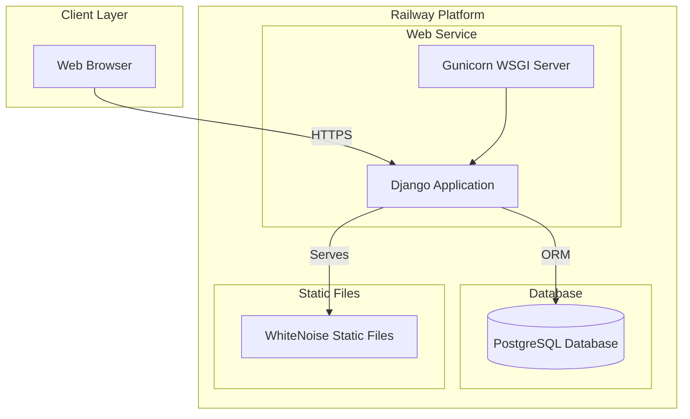

### Application Architecture

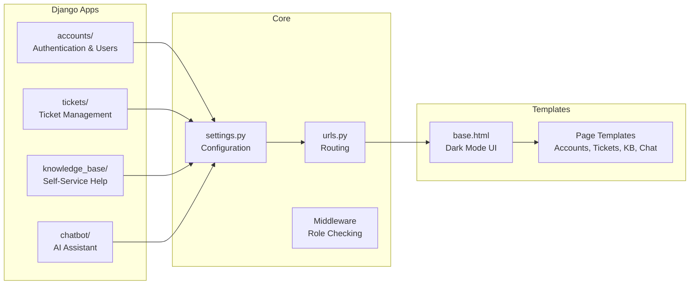

## Database Schema

### Entity Relationship Diagram

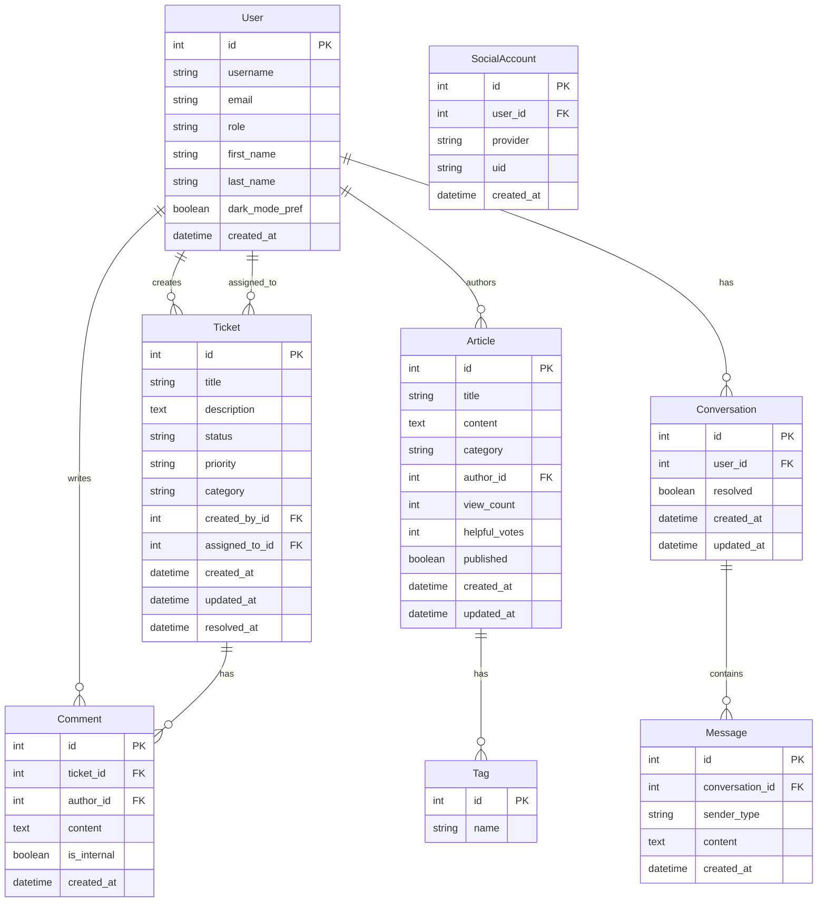

**Note on Social Accounts:**
- `SocialAccount` model is provided by `django-allauth`
- Links Google OAuth accounts to User accounts
- Stores provider (Google) and unique ID from provider
- One user can have multiple social accounts linked
- Users can link Google account to existing email/password account

## User Roles & Permissions

### Role Hierarchy

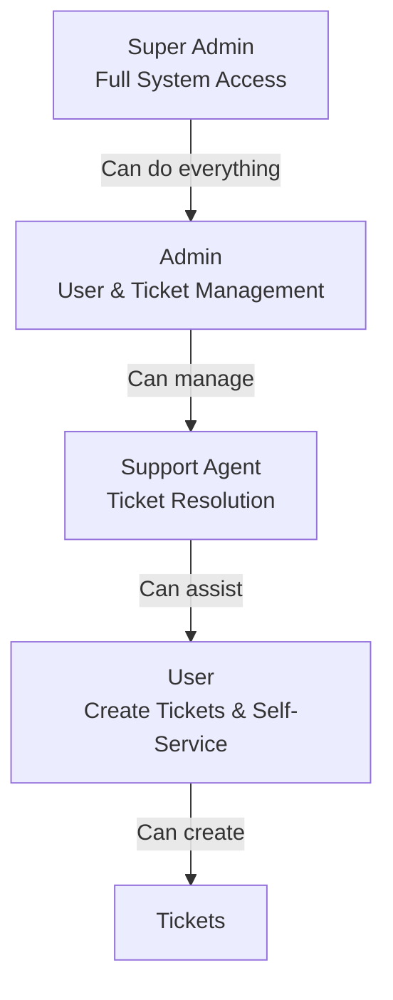

### Permission Matrix

| Feature | User | Support Agent | Admin | Super Admin |
|---------|------|---------------|-------|-------------|
| Create Ticket | ✅ | ✅ | ✅ | ✅ |
| View Own Tickets | ✅ | ✅ | ✅ | ✅ |
| View All Tickets | ❌ | ✅ | ✅ | ✅ |
| Assign Tickets | ❌ | ❌ | ✅ | ✅ |
| Resolve Tickets | ❌ | ✅ | ✅ | ✅ |
| Create Articles | ❌ | ✅ | ✅ | ✅ |
| Manage Users | ❌ | ❌ | ✅ | ✅ |
| System Settings | ❌ | ❌ | ❌ | ✅ |
| View Analytics | ❌ | Limited | ✅ | ✅ |

## User Flows

### Ticket Creation Flow

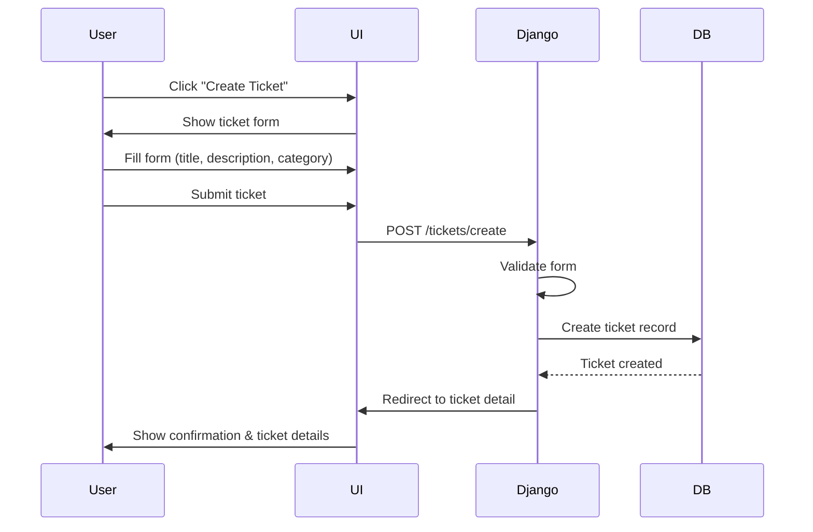

### Initial Loading Flow

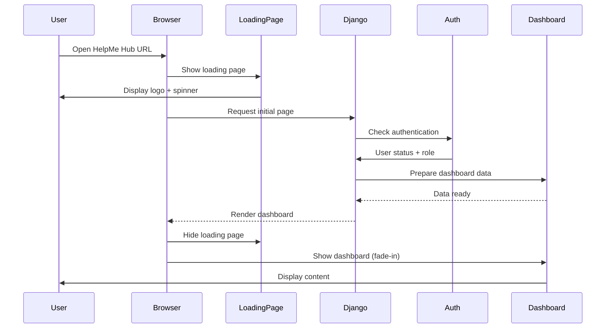

### Chatbot Interaction Flow

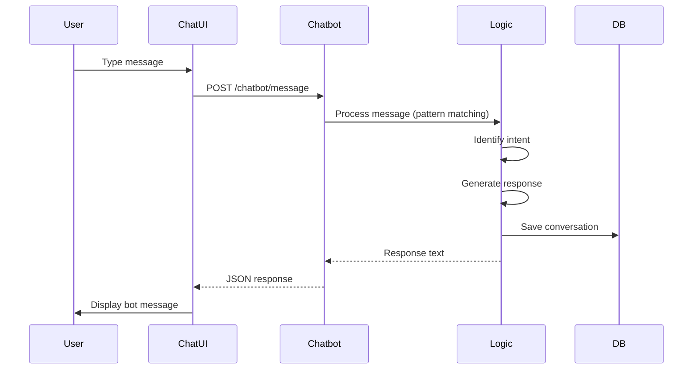

### Ticket Resolution Flow (Support Agent)

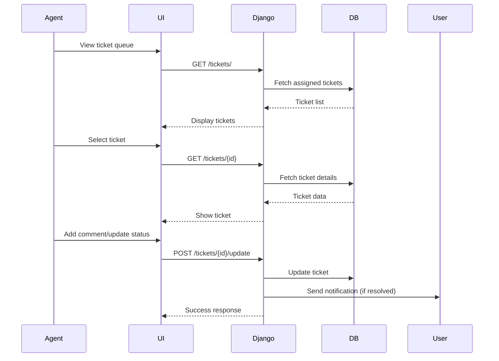

## UI/UX Design

### Design System

#### Color Palette (Dark Mode)

**Backgrounds:**
- Primary Background: `#121212` (gray-900)
- Surface/Cards: `#1E1E1E` (gray-800)
- Elevated Surface: `#2D2D2D` (gray-700)

**Text:**
- Primary Text: `#F3F4F6` (gray-100)
- Secondary Text: `#9CA3AF` (gray-400)
- Muted Text: `#6B7280` (gray-500)

**Accents:**
- Primary: `#3B82F6` (blue-600)
- Primary Hover: `#2563EB` (blue-700)
- Success: `#10B981` (green-500)
- Warning: `#F59E0B` (amber-500)
- Danger: `#EF4444` (red-500)
- Info: `#06B6D4` (cyan-500)

**Borders:**
- Default: `#374151` (gray-700)
- Focus: `#3B82F6` (blue-600)

### Layout Structure

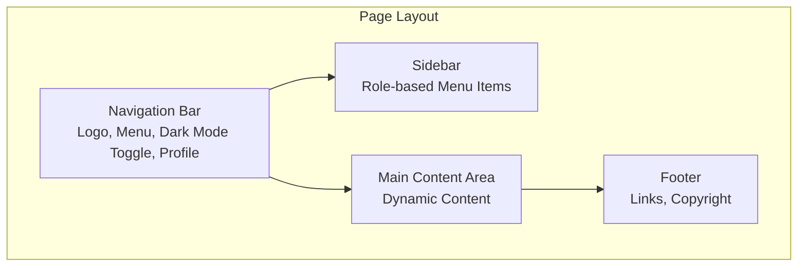

### Component Library

#### Navigation Bar
- **Height:** 64px
- **Background:** gray-800
- **Items:** Logo (left), Menu items (center), Dark mode toggle + Profile dropdown (right)
- **Sticky:** Yes (stays at top on scroll)

#### Sidebar
- **Width:** 256px (desktop), hidden (mobile)
- **Background:** gray-900
- **Items:** 
  - Dashboard
  - Tickets (with badge count)
  - Knowledge Base
  - Chatbot
  - Settings (if admin/agent)
- **Collapsible:** Yes (mobile menu)

#### Cards
- **Padding:** 24px
- **Border Radius:** 8px
- **Background:** gray-800
- **Border:** 1px solid gray-700
- **Shadow:** Subtle glow on hover

#### Buttons
- **Primary:** blue-600 background, white text, 8px radius
- **Secondary:** Transparent with gray-700 border
- **Danger:** red-600 background, white text
- **Size:** Default (px-4 py-2), Large (px-6 py-3)

#### Forms
- **Input:** gray-800 background, gray-700 border, gray-100 text
- **Focus:** blue-600 border with glow
- **Label:** gray-400 text, above input
- **Error:** red-500 text and border

#### Loading States

**Initial Loading Page:**
- **Purpose:** Displayed when app first loads or during authentication check
- **Design:** Full-screen centered content
- **Background:** gray-900 (#121212)
- **Elements:**
  - HelpMe Hub logo (animated fade-in)
  - Loading spinner (blue-600, smooth rotation)
  - Loading text: "Loading HelpMe Hub..." (gray-400)
- **Duration:** 1-2 seconds typically
- **Animation:** Fade-in logo, rotating spinner, smooth transitions

**Page Loading States:**
- **Skeleton Loaders:** Used for content areas while data loads
  - Gray-800 background
  - Animated shimmer effect (subtle pulse)
  - Mimics actual content layout (cards, text lines)
- **Spinner:** Small spinner for button actions
  - Blue-600 color
  - Size: 20px for buttons, 40px for page loads
- **Progress Bar:** For form submissions or long operations
  - Top of page, blue-600
  - Smooth animation

**Loading Page Layout:**

```
┌─────────────────────────────────────────────────┐
│                                                 │
│                                                 │
│                                                 │
│              [HelpMe Hub Logo]                  │
│              (Fade-in animation)                 │
│                                                 │
│              [Loading Spinner]                  │
│              (Rotating animation)                │
│                                                 │
│              Loading HelpMe Hub...               │
│              (gray-400 text)                    │
│                                                 │
│                                                 │
│                                                 │
└─────────────────────────────────────────────────┘
```

**Skeleton Loader Examples:**

**Ticket List Skeleton:**
```
┌─────────────────────────────────────────────────┐
│ ▓▓▓▓▓▓▓▓▓▓▓▓▓▓▓▓▓▓▓▓▓▓▓▓▓▓▓▓▓▓▓▓▓▓▓▓▓▓▓▓▓▓▓▓ │ (Title placeholder)
│ ▓▓▓▓▓▓▓▓▓▓▓▓▓▓▓▓▓▓▓▓▓▓▓▓▓▓▓▓▓▓▓▓▓▓▓▓▓▓▓▓▓▓▓▓ │ (Description)
│ ▓▓▓▓▓▓▓▓▓▓▓▓▓▓▓▓▓▓▓▓▓▓▓▓▓▓▓▓▓▓▓▓▓▓▓▓▓▓▓▓▓▓▓▓ │ (Metadata)
└─────────────────────────────────────────────────┘
```

**Dashboard Skeleton:**
```
┌─────────────────────────────────────────────────┐
│ ▓▓▓▓▓▓▓▓▓▓▓▓▓▓▓▓▓▓▓▓▓▓▓▓▓▓▓▓▓▓▓▓▓▓▓▓▓▓▓▓▓▓▓▓ │ (Welcome card)
│                                                 │
│ ┌──────────┐ ┌──────────┐ ┌──────────┐          │
│ │ ▓▓▓▓▓▓▓▓ │ │ ▓▓▓▓▓▓▓▓ │ │ ▓▓▓▓▓▓▓▓ │          │ (Stat cards)
│ └──────────┘ └──────────┘ └──────────┘          │
│                                                 │
│ ▓▓▓▓▓▓▓▓▓▓▓▓▓▓▓▓▓▓▓▓▓▓▓▓▓▓▓▓▓▓▓▓▓▓▓▓▓▓▓▓▓▓▓▓ │ (Recent items)
└─────────────────────────────────────────────────┘
```

**Loading States by Context:**
- **Initial App Load:** Full-screen loading page
- **Page Navigation:** Skeleton loaders in content area
- **Form Submission:** Button spinner + disabled state
- **Data Refresh:** Subtle spinner in corner
- **Search/Filter:** Loading overlay on results area

### Responsive Design (Mobile/Tablet Friendly)

**Design Philosophy:**
- **Mobile-First Approach:** Design for mobile, then enhance for larger screens
- **Consistent Look:** Same visual design across all devices
- **Touch-Friendly:** All interactive elements optimized for touch
- **Progressive Enhancement:** Core functionality works on all devices

#### Breakpoints

**Tailwind CSS Breakpoints:**
- **Mobile (default):** < 640px (sm)
- **Tablet:** 640px - 1024px (sm, md, lg)
- **Desktop:** > 1024px (lg, xl, 2xl)

**Device-Specific Considerations:**
- **Mobile Phones:** 320px - 640px
- **Tablets (Portrait):** 640px - 768px
- **Tablets (Landscape):** 768px - 1024px
- **Desktop:** 1024px+

#### Responsive Navigation

**Desktop Navigation:**
```
┌─────────────────────────────────────────────────┐
│ [Logo]  [Menu Items]  [Dark Mode] [Profile]    │
└─────────────────────────────────────────────────┘
```

**Mobile/Tablet Navigation:**
```
┌─────────────────────────────────────────────────┐
│ [☰ Menu] [Logo]              [Dark Mode] [Profile]│
└─────────────────────────────────────────────────┘
```

**Mobile Menu (Hamburger Menu):**
- **Trigger:** Hamburger icon (☰) in top-left
- **Behavior:** Slide-in from left side
- **Overlay:** Dark backdrop (gray-900 with opacity)
- **Animation:** Smooth slide-in/out (300ms)
- **Items:** Same menu items as desktop sidebar
- **Close:** Tap outside menu or X button

**Mobile Menu Layout:**
```
┌─────────────────────────────────────────────────┐
│ [X] HelpMe Hub                                  │
├─────────────────────────────────────────────────┤
│                                                 │
│  Dashboard                                      │
│  Tickets (3)                                    │
│  Knowledge Base                                  │
│  AI Assistant                                   │
│  Settings                                       │
│                                                 │
│  ─────────────────────────────                  │
│                                                 │
│  Profile                                        │
│  Logout                                         │
│                                                 │
└─────────────────────────────────────────────────┘
```

#### Responsive Sidebar

**Desktop:**
- Always visible on left side
- Fixed width: 256px
- Full height sidebar

**Tablet:**
- Collapsible sidebar
- Can be toggled on/off
- Overlay when open (on smaller tablets)
- Full width when open

**Mobile:**
- Hidden by default
- Accessible via hamburger menu
- Full-screen overlay when open
- Same content as desktop sidebar

#### Touch-Friendly Components

**Buttons:**
- **Minimum Size:** 44px × 44px (Apple HIG recommendation)
- **Spacing:** Minimum 8px between touch targets
- **Padding:** Increased on mobile (px-5 py-3 instead of px-4 py-2)
- **Visual Feedback:** Clear active/pressed states

**Form Inputs:**
- **Height:** Minimum 44px for easy tapping
- **Font Size:** Minimum 16px to prevent zoom on iOS
- **Spacing:** Generous spacing between form fields
- **Labels:** Always visible, above inputs

**Cards:**
- **Padding:** Responsive (24px desktop, 16px mobile)
- **Touch Targets:** Entire card clickable where appropriate
- **Spacing:** Adequate margin between cards (16px mobile, 24px desktop)

**Tables/Lists:**
- **Horizontal Scroll:** On mobile for wide tables
- **Card View:** Convert tables to cards on mobile
- **Swipe Actions:** Optional swipe-to-delete on mobile

#### Responsive Grid Layouts

**Desktop (3+ columns):**
```
┌──────────┬──────────┬──────────┐
│   Card   │   Card   │   Card   │
└──────────┴──────────┴──────────┘
```

**Tablet (2 columns):**
```
┌──────────┬──────────┐
│   Card   │   Card   │
├──────────┼──────────┤
│   Card   │   Card   │
└──────────┴──────────┘
```

**Mobile (1 column):**
```
┌──────────────┐
│    Card      │
├──────────────┤
│    Card      │
├──────────────┤
│    Card      │
└──────────────┘
```

#### Typography Scaling

**Headings:**
- **Desktop:** text-3xl, text-2xl, text-xl
- **Tablet:** text-2xl, text-xl, text-lg
- **Mobile:** text-xl, text-lg, text-base

**Body Text:**
- **Desktop:** text-base (16px)
- **Tablet:** text-base (16px)
- **Mobile:** text-base (16px) - no scaling to maintain readability

#### Responsive Images

- **Max Width:** 100% to prevent overflow
- **Height:** Auto to maintain aspect ratio
- **Lazy Loading:** Enabled for performance
- **Responsive Sizes:** Different image sizes for different breakpoints

#### Mobile-Specific Features

**Bottom Navigation (Optional for Mobile):**
- Fixed bottom bar for quick access
- Icons: Home, Tickets, Search, Profile
- Only on mobile (< 640px)
- Replaces sidebar navigation

**Pull-to-Refresh:**
- Native mobile gesture support
- Refresh content by pulling down
- Visual feedback during refresh

**Swipe Gestures:**
- Swipe left/right on cards for actions
- Swipe to delete (with confirmation)
- Smooth animations

#### Tablet Optimizations

**Landscape Mode:**
- Sidebar visible (collapsible)
- 2-column layouts where appropriate
- More content visible without scrolling

**Portrait Mode:**
- Similar to mobile but with more space
- 2-column layouts for cards
- Sidebar accessible via menu

#### Consistent Design Across Devices

**Color Palette:**
- Same colors on all devices
- No device-specific color changes

**Spacing:**
- Proportional scaling (maintains visual hierarchy)
- Responsive padding/margins using Tailwind utilities

**Components:**
- Same component styles across devices
- Only layout changes, not design

**Animations:**
- Same animation timing and easing
- Smooth transitions on all devices

#### Responsive Utilities (Tailwind CSS)

**Common Patterns:**
- `hidden md:block` - Hide on mobile, show on tablet+
- `flex-col md:flex-row` - Stack on mobile, row on desktop
- `text-sm md:text-base` - Smaller text on mobile
- `p-4 md:p-6` - Less padding on mobile
- `w-full md:w-1/2` - Full width mobile, half desktop

### Page Layouts

#### Dashboard Layout

**Desktop:**
```
┌─────────────────────────────────────────────────┐
│ Navigation Bar                                  │
├──────────┬──────────────────────────────────────┤
│          │                                      │
│ Sidebar  │  Main Content Area                   │
│          │  - Welcome message                   │
│ - Dash   │  - Quick stats cards (3 columns)     │
│ - Tickets│  - Recent tickets/articles           │
│ - KB     │  - Quick actions                     │
│ - Chat   │                                      │
│          │                                      │
└──────────┴──────────────────────────────────────┘
```

**Tablet:**
```
┌─────────────────────────────────────────────────┐
│ [☰] Navigation Bar                              │
├──────────┬──────────────────────────────────────┤
│          │                                      │
│ Sidebar  │  Main Content Area                   │
│ (Toggle) │  - Welcome message                   │
│          │  - Quick stats cards (2 columns)     │
│          │  - Recent tickets/articles           │
│          │  - Quick actions                     │
│          │                                      │
└──────────┴──────────────────────────────────────┘
```

**Mobile:**
```
┌─────────────────────────────────────────────────┐
│ [☰] [Logo]              [Dark Mode] [Profile]  │
├─────────────────────────────────────────────────┤
│                                                 │
│  Main Content Area                             │
│  - Welcome message                             │
│  - Quick stats cards (1 column, stacked)       │
│  - Recent tickets/articles                     │
│  - Quick actions                               │
│                                                 │
│                                                 │
│                                                 │
│  [Bottom Navigation Bar]                       │
│  [Home] [Tickets] [Search] [Profile]           │
└─────────────────────────────────────────────────┘
```

#### Ticket List Page

**Desktop:**
```
┌─────────────────────────────────────────────────┐
│ Navigation Bar                                  │
├──────────┬──────────────────────────────────────┤
│          │  Tickets                             │
│ Sidebar  │  ┌────────────────────────────────┐  │
│          │  │ [Search] [Filter] [+ New]      │  │
│          │  └────────────────────────────────┘  │
│          │  ┌────────────────────────────────┐  │
│          │  │ Ticket Card 1                 │  │
│          │  │ - Title, Status, Priority      │  │
│          │  │ - Created date, Assigned to   │  │
│          │  └────────────────────────────────┘  │
│          │  ┌────────────────────────────────┐  │
│          │  │ Ticket Card 2                 │  │
│          │  └────────────────────────────────┘  │
│          │  [Pagination]                         │
└──────────┴──────────────────────────────────────┘
```

**Tablet:**
```
┌─────────────────────────────────────────────────┐
│ [☰] Navigation Bar                              │
├──────────┬──────────────────────────────────────┤
│          │  Tickets                             │
│ Sidebar  │  ┌────────────────────────────────┐  │
│ (Toggle) │  │ [Search] [Filter] [+ New]      │  │
│          │  └────────────────────────────────┘  │
│          │  ┌──────────┐ ┌──────────┐          │
│          │  │ Ticket 1│ │ Ticket 2│          │
│          │  └──────────┘ └──────────┘          │
│          │  ┌──────────┐ ┌──────────┐          │
│          │  │ Ticket 3│ │ Ticket 4│          │
│          │  └──────────┘ └──────────┘          │
│          │  [Pagination]                         │
└──────────┴──────────────────────────────────────┘
```

**Mobile:**
```
┌─────────────────────────────────────────────────┐
│ [☰] [Logo]              [Dark Mode] [Profile]  │
├─────────────────────────────────────────────────┤
│  Tickets                                         │
│  ┌────────────────────────────────────────────┐  │
│  │ [Search]                    [+ New]       │  │
│  └────────────────────────────────────────────┘  │
│  ┌────────────────────────────────────────────┐  │
│  │ Ticket Card 1                              │  │
│  │ - Title, Status, Priority                  │  │
│  │ - Created date, Assigned to                │  │
│  └────────────────────────────────────────────┘  │
│  ┌────────────────────────────────────────────┐  │
│  │ Ticket Card 2                              │  │
│  └────────────────────────────────────────────┘  │
│  [Pagination]                                     │
│                                                 │
│  [Bottom Navigation Bar]                       │
│  [Home] [Tickets] [Search] [Profile]           │
└─────────────────────────────────────────────────┘
```

#### Chatbot Interface

**Desktop:**
```
┌─────────────────────────────────────────────────┐
│ Navigation Bar                                  │
├──────────┬──────────────────────────────────────┤
│          │  AI Assistant                        │
│ Sidebar  │  ┌────────────────────────────────┐  │
│          │  │ Chat Messages Area              │  │
│          │  │                                │  │
│          │  │ Bot: Hello! How can I help?    │  │
│          │  │ You: I need to reset password   │  │
│          │  │ Bot: I can help with that...   │  │
│          │  │                                │  │
│          │  └────────────────────────────────┘  │
│          │  ┌────────────────────────────────┐  │
│          │  │ [Type message...] [Send]       │  │
│          │  └────────────────────────────────┘  │
└──────────┴──────────────────────────────────────┘
```

**Tablet/Mobile:**
```
┌─────────────────────────────────────────────────┐
│ [☰] [Logo]              [Dark Mode] [Profile]  │
├─────────────────────────────────────────────────┤
│  AI Assistant                                    │
│  ┌────────────────────────────────────────────┐  │
│  │                                            │  │
│  │ Chat Messages Area                        │  │
│  │                                            │  │
│  │ Bot: Hello! How can I help?              │  │
│  │ You: I need to reset password             │  │
│  │ Bot: I can help with that...             │  │
│  │                                            │  │
│  │                                            │  │
│  └────────────────────────────────────────────┘  │
│  ┌────────────────────────────────────────────┐  │
│  │ [Type message...]              [Send]       │  │
│  └────────────────────────────────────────────┘  │
│                                                 │
│  [Bottom Navigation Bar]                       │
│  [Home] [Tickets] [Search] [Profile]           │
└─────────────────────────────────────────────────┘
```

#### Login Page

**Desktop/Tablet:**
```
┌─────────────────────────────────────────────────┐
│                                                 │
│              [HelpMe Hub Logo]                  │
│                                                 │
│              Welcome Back                       │
│              Sign in to your account            │
│                                                 │
│         ┌─────────────────────────────┐         │
│         │                             │         │
│         │  Email Address               │         │
│         │  [________________________]  │         │
│         │                             │         │
│         │  Password                   │         │
│         │  [________________________]  │         │
│         │                             │         │
│         │  [ ] Remember me            │         │
│         │                             │         │
│         │  [Sign In]                  │         │
│         │                             │         │
│         │  ─────── or ───────         │         │
│         │                             │         │
│         │  [🔵 Sign in with Google]   │         │
│         │                             │         │
│         │  Forgot password?            │         │
│         │                             │         │
│         │  Don't have an account?     │         │
│         │  [Create Account]           │         │
│         └─────────────────────────────┘         │
│                                                 │
└─────────────────────────────────────────────────┘
```

**Mobile:**
```
┌─────────────────────────────────────────────────┐
│                                                 │
│              [HelpMe Hub Logo]                  │
│                                                 │
│              Welcome Back                       │
│              Sign in to your account            │
│                                                 │
│  ┌───────────────────────────────────────────┐  │
│  │                                           │  │
│  │  Email Address                            │  │
│  │  [────────────────────────────────────]   │  │
│  │                                           │  │
│  │  Password                                 │  │
│  │  [────────────────────────────────────]   │  │
│  │                                           │  │
│  │  [ ] Remember me                          │  │
│  │                                           │  │
│  │  [Sign In]                                │  │
│  │                                           │  │
│  │  ─────── or ───────                       │  │
│  │                                           │  │
│  │  [🔵 Sign in with Google]                 │  │
│  │                                           │  │
│  │  Forgot password?                          │  │
│  │                                           │  │
│  │  Don't have an account?                   │  │
│  │  [Create Account]                         │  │
│  └───────────────────────────────────────────┘  │
│                                                 │
└─────────────────────────────────────────────────┘
```

#### Registration Page

**Desktop/Tablet:**
```
┌─────────────────────────────────────────────────┐
│                                                 │
│              [HelpMe Hub Logo]                  │
│                                                 │
│              Create Your Account                │
│              Join HelpMe Hub today               │
│                                                 │
│         ┌─────────────────────────────┐         │
│         │                             │         │
│         │  Email Address               │         │
│         │  [________________________]  │         │
│         │                             │         │
│         │  Username (optional)         │         │
│         │  [________________________]  │         │
│         │                             │         │
│         │  Password                   │         │
│         │  [________________________]  │         │
│         │                             │         │
│         │  Confirm Password           │         │
│         │  [________________________]  │         │
│         │                             │         │
│         │  [ ] I agree to terms       │         │
│         │                             │         │
│         │  [Create Account]           │         │
│         │                             │         │
│         │  ─────── or ───────         │         │
│         │                             │         │
│         │  [🔵 Sign up with Google]   │         │
│         │                             │         │
│         │  Already have an account?   │         │
│         │  [Sign In]                  │         │
│         └─────────────────────────────┘         │
│                                                 │
└─────────────────────────────────────────────────┘
```

**Mobile:**
```
┌─────────────────────────────────────────────────┐
│                                                 │
│              [HelpMe Hub Logo]                  │
│                                                 │
│              Create Your Account                │
│              Join HelpMe Hub today               │
│                                                 │
│  ┌───────────────────────────────────────────┐  │
│  │                                           │  │
│  │  Email Address                            │  │
│  │  [────────────────────────────────────]   │  │
│  │                                           │  │
│  │  Username (optional)                      │  │
│  │  [────────────────────────────────────]   │  │
│  │                                           │  │
│  │  Password                                 │  │
│  │  [────────────────────────────────────]   │  │
│  │                                           │  │
│  │  Confirm Password                         │  │
│  │  [────────────────────────────────────]   │  │
│  │                                           │  │
│  │  [ ] I agree to terms                     │  │
│  │                                           │  │
│  │  [Create Account]                         │  │
│  │                                           │  │
│  │  ─────── or ───────                       │  │
│  │                                           │  │
│  │  [🔵 Sign up with Google]                 │  │
│  │                                           │  │
│  │  Already have an account?                 │  │
│  │  [Sign In]                                │  │
│  └───────────────────────────────────────────┘  │
│                                                 │
└─────────────────────────────────────────────────┘
```

**Login/Registration Page Design Notes:**
- Centered card layout on dark background
- Clear visual separation between traditional and Google auth
- Google button: Blue background with Google logo/icon
- Responsive design (stacks on mobile)
- Smooth transitions and hover effects
- Error messages displayed inline
- Password strength indicator on registration

## Information Architecture

### Site Map

```
HelpMe Hub
├── Loading Page (Initial Load)
│   └── Shows during app initialization and authentication check
│
├── Public Pages
│   ├── Login
│   └── Register
│
├── User Dashboard (Role: User)
│   ├── Overview
│   ├── My Tickets
│   │   ├── Create Ticket
│   │   └── Ticket Detail
│   ├── Knowledge Base
│   │   ├── Browse Articles
│   │   ├── Search
│   │   └── Article Detail
│   ├── AI Assistant (Chatbot)
│   └── Profile
│
├── Support Agent Dashboard (Role: Support Agent)
│   ├── Overview
│   ├── Ticket Queue
│   │   ├── Assigned Tickets
│   │   ├── Unassigned Tickets
│   │   └── Ticket Detail
│   ├── Knowledge Base (Create/Edit)
│   ├── AI Assistant
│   └── Profile
│
├── Admin Dashboard (Role: Admin)
│   ├── Overview
│   ├── All Tickets
│   ├── User Management
│   ├── Ticket Assignment
│   ├── Knowledge Base Management
│   ├── Analytics
│   └── Settings
│
└── Super Admin Dashboard (Role: Super Admin)
    ├── Everything from Admin
    ├── System Settings
    ├── Role Management
    └── Advanced Analytics
```

## Technical Architecture

### Request Flow

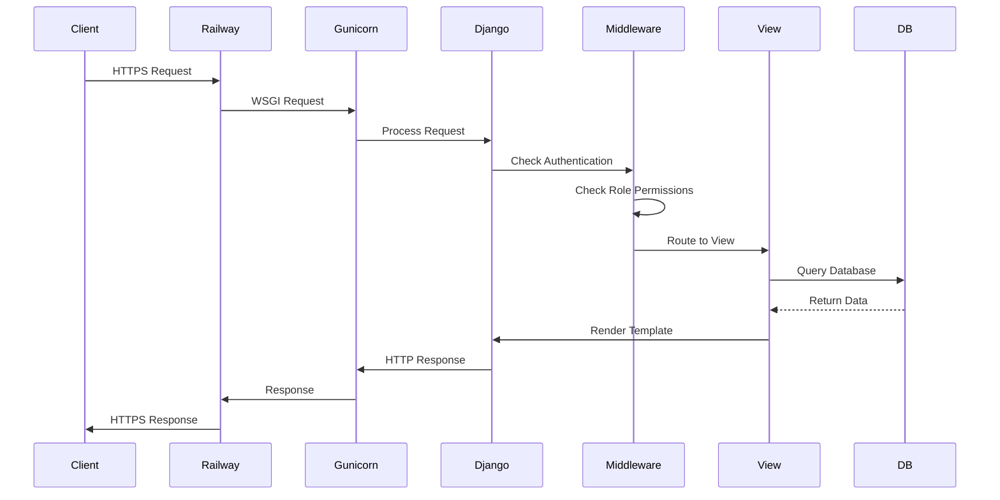

### Static Files Flow

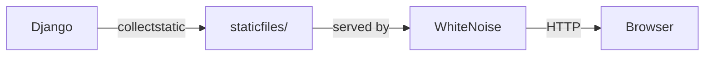

### Loading Page Implementation

**Technical Approach:**
- **Template:** `templates/loading.html` - Standalone loading page
- **JavaScript:** `static/js/loading.js` - Handles loading state and transitions
- **CSS:** Tailwind classes + custom animations in `static/css/custom.css`

**Implementation Details:**
1. **Initial Load:**
   - Loading page shown immediately on app entry
   - JavaScript checks authentication status
   - Fetches user data and role
   - Transitions to appropriate dashboard

2. **Loading States:**
   - CSS animations for spinner (rotate) and logo (fade-in)
   - JavaScript manages show/hide transitions
   - Smooth fade-out when content is ready

3. **Skeleton Loaders:**
   - CSS-based shimmer animation
   - Tailwind `animate-pulse` utility
   - Placeholder elements match content structure

4. **Performance:**
   - Loading page is lightweight (minimal HTML/CSS)
   - Fast initial render
   - Non-blocking JavaScript

**Files to Create:**
- `templates/loading.html` - Loading page template
- `static/js/loading.js` - Loading state management
- `static/css/loading.css` - Loading animations (or in custom.css)

## Security Architecture

### Authentication Methods

The application supports two authentication methods:

1. **Traditional Account Creation**
   - Email and password registration
   - Username optional (email can be used as username)
   - Email verification (optional but recommended)

2. **Google OAuth (Gmail Sign-In)**
   - One-click sign-in with Google account
   - Automatic account creation if first time
   - Uses Google email and profile information
   - Secure OAuth 2.0 flow

### Traditional Login Flow

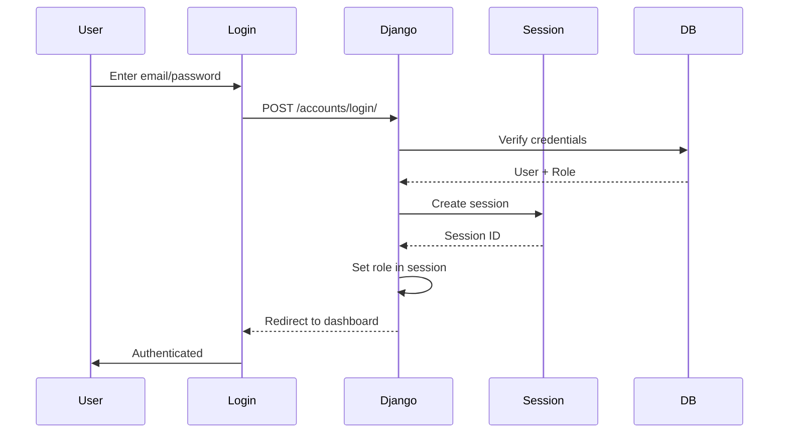

### Google OAuth Login Flow

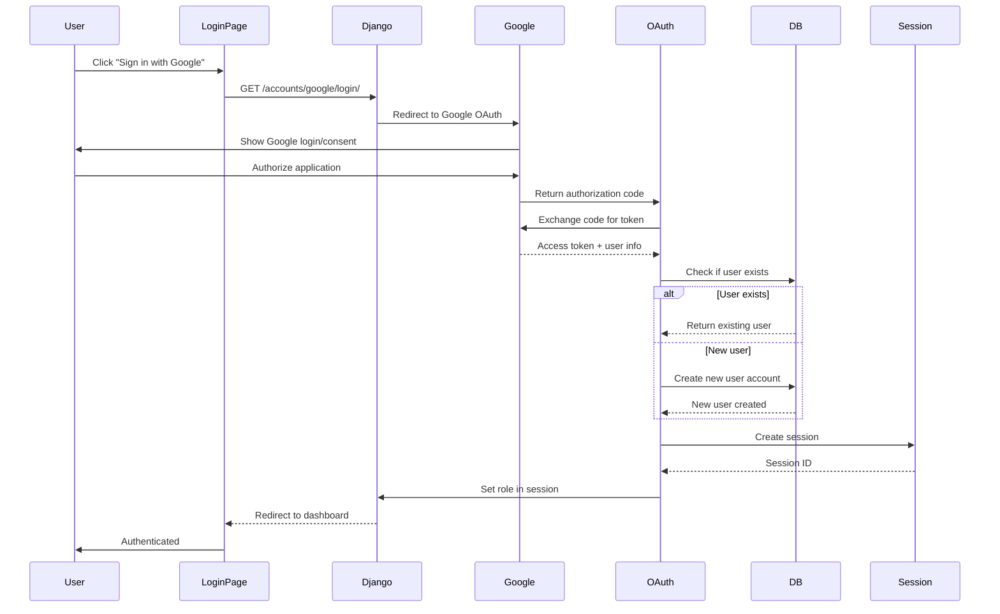

### Registration Flow

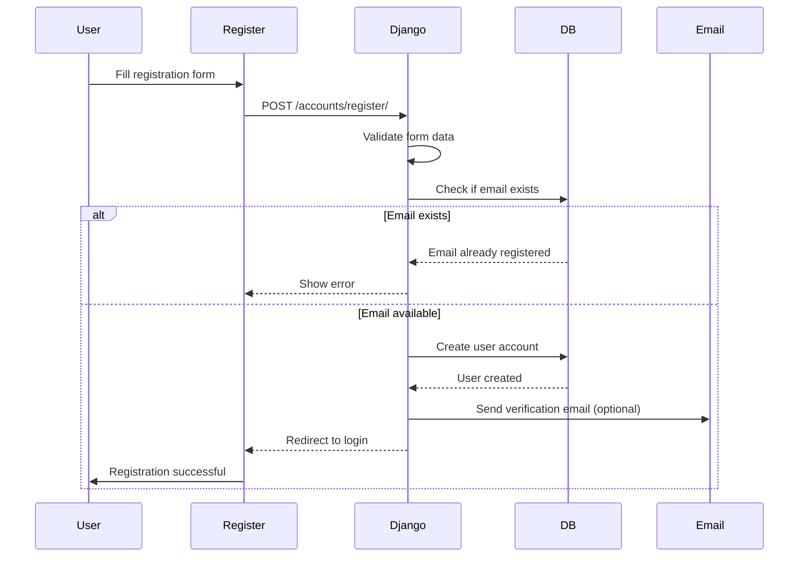

### Authorization Check

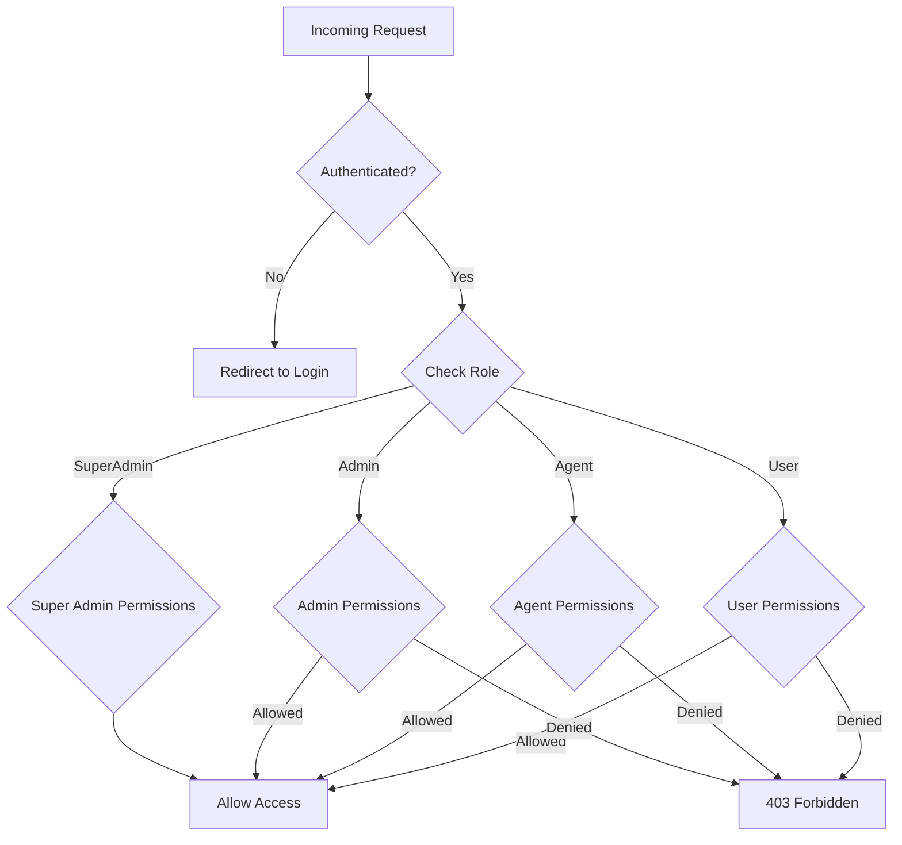

## Performance Considerations

### Database Optimization
- Indexes on frequently queried fields (ticket status, user_id, created_at)
- Pagination for large lists (tickets, articles)
- Select_related for foreign keys
- Prefetch_related for many-to-many

### Caching Strategy
- Template fragment caching for static content
- Query result caching for popular articles
- Session caching

### Static Files
- WhiteNoise for serving static files
- Compressed CSS/JS
- Image optimization

### Responsive Design Implementation

**HTML Viewport Meta Tag:**
```html
<meta name="viewport" content="width=device-width, initial-scale=1.0">
```

**Tailwind CSS Configuration:**
- Mobile-first breakpoints configured
- Responsive utilities available (`sm:`, `md:`, `lg:`, `xl:`, `2xl:`)
- Custom breakpoints if needed

**CSS Strategy:**
- Use Tailwind responsive utilities
- Custom CSS only for complex responsive behaviors
- Media queries for edge cases

**JavaScript for Responsive Features:**
- Hamburger menu toggle
- Sidebar show/hide on tablet
- Touch gesture handlers (swipe, pull-to-refresh)
- Viewport resize handlers

**Testing Strategy:**
- Test on real devices (iOS, Android)
- Browser DevTools responsive mode
- Test all breakpoints (320px, 640px, 768px, 1024px, 1280px+)
- Test portrait and landscape orientations
- Test touch interactions

**Performance on Mobile:**
- Optimize images for mobile (smaller file sizes)
- Lazy load images below the fold
- Minimize JavaScript bundle size
- Use CSS transforms for animations (GPU accelerated)
- Avoid layout shifts during loading

**Accessibility on Mobile:**
- Touch targets minimum 44px × 44px
- Adequate spacing between interactive elements
- Text readable without zooming (minimum 16px)
- Keyboard navigation support (for tablets with keyboards)

## Scalability Considerations

### Current Architecture (MVP)
- Single Django application
- PostgreSQL database
- WhiteNoise for static files
- Railway hosting

### Future Enhancements
- CDN for static files
- Redis for caching
- Celery for background tasks
- Separate media storage (S3)
- Load balancing (if needed)

## API Endpoints (Internal)

### Authentication
- `GET /accounts/login/` - Login page
- `POST /accounts/login/` - Traditional email/password login
- `GET /accounts/google/login/` - Initiate Google OAuth login
- `GET /accounts/google/callback/` - Google OAuth callback
- `GET /accounts/register/` - Registration page
- `POST /accounts/register/` - Create new account
- `POST /accounts/logout/` - User logout

### Tickets
- `GET /tickets/` - List tickets (filtered by role)
- `POST /tickets/create/` - Create ticket
- `GET /tickets/{id}/` - Ticket detail
- `POST /tickets/{id}/update/` - Update ticket
- `POST /tickets/{id}/comment/` - Add comment

### Knowledge Base
- `GET /knowledge-base/` - List articles
- `GET /knowledge-base/{id}/` - Article detail
- `GET /knowledge-base/search/` - Search articles
- `POST /knowledge-base/{id}/vote/` - Vote helpful

### Chatbot
- `GET /chatbot/` - Chat interface
- `POST /chatbot/message/` - Send message (AJAX)

## Google OAuth Implementation

### Required Packages

- `django-allauth` - Comprehensive authentication solution with social auth support
- `requests` - For OAuth token exchange (included with django-allauth)

### Google OAuth Setup

**1. Google Cloud Console Configuration:**
- Create Google Cloud Project
- Enable Google+ API (or Google Identity API)
- Create OAuth 2.0 credentials
- Add authorized redirect URI: `https://your-domain.com/accounts/google/login/callback/`
  **Important:** The callback URL must be exactly `/accounts/google/login/callback/` (not `/accounts/google/callback/`)
- Get Client ID and Client Secret

**2. Django Configuration:**
- Install `django-allauth`
- Add to `INSTALLED_APPS`: `'allauth', 'allauth.account', 'allauth.socialaccount', 'allauth.socialaccount.providers.google'`
- Configure `SOCIALACCOUNT_PROVIDERS` in settings
- Add Google OAuth credentials to environment variables

**3. Database:**
- django-allauth creates its own models for social accounts
- `SocialAccount` model links Google accounts to User accounts
- Automatic migration on setup

**4. User Account Linking:**
- If Google email matches existing account: Link accounts
- If new user: Create account automatically with Google email
- Default role: "User" (can be changed by admin)
- Profile information pulled from Google (name, profile picture)

**5. Security Considerations:**
- OAuth tokens stored securely
- Email verification handled by Google
- CSRF protection on OAuth endpoints
- Secure session management

### Environment Variables Needed

```
GOOGLE_OAUTH2_CLIENT_ID=your_client_id
GOOGLE_OAUTH2_CLIENT_SECRET=your_client_secret
SOCIALACCOUNT_AUTO_SIGNUP=True
SOCIALACCOUNT_EMAIL_VERIFICATION='none'  # Google already verifies
```

### User Experience Flow

1. User clicks "Sign in with Google" button
2. Redirected to Google login/consent screen
3. User authorizes application
4. Redirected back to HelpMe Hub
5. Account created automatically (if first time) or logged in
6. Redirected to appropriate dashboard based on role

### Benefits

- **Faster onboarding**: One-click sign-in
- **Reduced password management**: Users don't need to remember password
- **Email verification**: Google accounts are already verified
- **Profile information**: Automatically populated from Google
- **Security**: OAuth 2.0 is industry standard
- **User choice**: Users can still create traditional accounts

## Design Principles

1. **Calming & Professional**: Dark mode with soft colors, minimal design
2. **Accessible**: WCAG AA contrast, keyboard navigation, screen reader support
3. **Responsive & Consistent**: Mobile-first design, works on all screen sizes, same look and feel across devices
4. **Touch-Friendly**: Optimized for mobile/tablet with appropriate touch targets and gestures
5. **Fast**: Optimized queries, lazy loading, efficient rendering
6. **Intuitive**: Clear navigation, obvious actions, helpful feedback
7. **Secure**: Role-based access, CSRF protection, secure sessions

## Next Steps

1. Review and refine this architecture
2. Create detailed wireframes for key pages
3. Define component specifications
4. Create style guide document
5. Build prototype/mockups
6. Get feedback and iterate
7. Begin implementation

